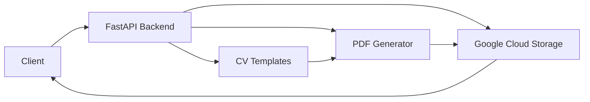

# ASI CV Generator

A FastAPI-based web application for generating and managing CVs.

## Features

- CV generation from templates
- Google Cloud Storage integration
- PDF conversion support
- RESTful API endpoints

## Prerequisites

- Python 3.8+
- Docker (optional)
- Google Cloud credentials

## Setup

1. Clone the repository:
```bash
git clone https://github.com/concaption/cv-generator.git
cd cv-generator
```

2. Copy the example environment file:
```bash
cp .env.example .env
```

3. Set up your environment variables in `.env`

4. Install dependencies:
```bash
# Using make
make install

# Or manually in a virtual environment
python -m venv .venv
source .venv/bin/activate  # On Windows: .venv\Scripts\activate
pip install -r requirements.txt
```

## Running the Application

### Local Development
```bash
uvicorn main:app --reload --host 0.0.0.0 --port 8000
```

### Using Docker
```bash
docker-compose up --build
```

## API Documentation

Once running, access the API documentation at:
- Swagger UI: `http://localhost:8000/docs`
- ReDoc: `http://localhost:8000/redoc`

## Project Structure

```
asi-cv-generator/
├── app/
│   ├── config.py         # Configuration settings
│   ├── schema.py         # Data models
│   └── routers/          # API routes
├── templates/            # CV templates
├── output/              # Generated CVs
├── main.py             # Application entry point
├── requirements.txt    # Python dependencies
└── docker-compose.yaml # Docker configuration
```

## System Architecture



[](https://www.upwork.com/fl/~01506cf82cf7f3671e?mp_source=share)